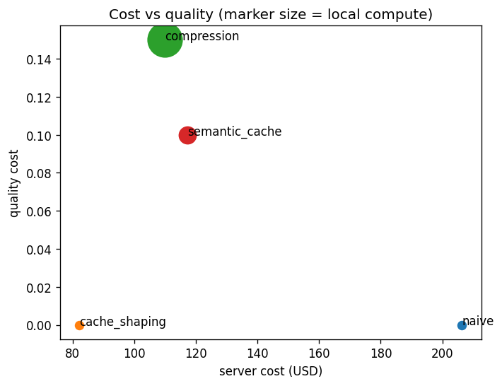

# Cache-Aware Client-Side Request Planning for Black-Box LLM APIs

Lossless billed-cost reduction for applications that call a paid, per-token LLM API, by aligning requests to the provider's prompt cache. No model ownership, no quality loss, no extra local compute.

Research artifact plus a paper draft. 34 tests passing.

## The idea in one paragraph

If you consume an LLM through a black-box, per-token API, one invariant governs your bill: **you pay for the tokens the server processes, so relocating compute to the client changes nothing unless it reduces billable tokens or calls at fixed quality.** That rules out the popular tricks (client-side tokenization saves nothing, speculative decoding and split execution are impossible without the weights). It also leaves exactly one intervention that is both lossless and local-compute-free: arranging your requests so more of each prompt prefix hits the provider's cache. This repo formalizes that design space, gives a cost model and a taxonomy of what is even possible for an API consumer, and implements a greedy prefix-clustering scheduler that exploits the cache from the outside.

## Headline result

In simulation under representative public cache parameters (300s TTL, 1024-token minimum prefix, 0.1x cache read, 1.25x cache write), on an agentic tool-use workload:

| per-step service time (s) | naive ($) | shaped ($) | reduction |
|---------------------------|-----------|------------|-----------|
| 10 | 82.20 | 82.20 | 0% |
| 40 | 82.20 | 82.20 | 0% |
| 75 | 206.40 | 82.20 | **60.2%** |
| 100 | 206.40 | 82.20 | **60.2%** |
| 150 | 206.40 | 82.20 | **60.2%** |
| 300 | 206.40 | 206.40 | 0% |

The structure is the point. Shaping helps in the band where the request rate is fast enough that grouped same-prefix calls land inside the cache window but the interleaved naive order does not. Too fast and the naive order already keeps the cache warm; too slow and even adjacent calls fall outside the window. We report where it fails, not just where it wins.

At a fixed operating point, cache shaping Pareto-dominates the lossy alternatives (cheapest server cost, and the only one with zero local compute and zero quality cost):

| method | server ($) | local ($) | quality cost |
|--------|-----------|-----------|--------------|
| cache shaping | **82.20** | **0.000** | **0.00** |
| prompt compression | 109.92 | 0.160 | 0.15 |
| semantic caching | 117.15 | 0.032 | 0.10 |
| naive | 206.40 | 0.000 | 0.00 |



## Quickstart

Requires Python 3.10 or newer.

```bash
python -m venv .venv && source .venv/bin/activate
pip install -e ".[dev,figures]"
pytest tests/            # 34 tests
python docs/paper/run_eval.py   # regenerates every table above and the figure
```

Minimal use of the planner:

```python
from ccrp.cost_model import CacheParams
from ccrp.pipeline import plan

params = CacheParams(ttl_s=300.0, min_prefix_tokens=1024, read_discount=0.1,
                     write_multiplier=1.25, input_price_per_1k=3.0, output_price_per_1k=15.0)

# Each raw item carries its prefix content (for cache-key derivation) and token counts.
raw = [
    {"id": "a", "prefix_parts": [{"sys": "agent one"}], "prefix_tokens": 2000,
     "suffix_tokens": 100, "output_tokens": 50, "arrival_s": 0.0},
    # ...
]
result = plan(raw, params, service_time_s=100.0, max_slack_s=10_000.0)
print(result["naive_cost"], result["shaped_cost"], result["order"])
```

## What is in here

| Path | What it is |
|------|------------|
| `ccrp/cost_model.py`, `ccrp/cache_sim.py` | Billed-cost model and a provider prompt-cache simulator (TTL, min prefix, read/write pricing) |
| `ccrp/canonicalize.py`, `ccrp/clustering.py` | Byte-stable prefix-key derivation and prefix grouping |
| `ccrp/scheduler.py` | The greedy prefix-clustering scheduler (the centerpiece) |
| `ccrp/simulate.py`, `ccrp/pipeline.py` | Order pricing and the end-to-end canonicalize, cluster, schedule, price chain |
| `ccrp/workloads.py`, `ccrp/baselines.py` | Agentic and chat workloads, plus compression and semantic-cache baselines |
| `ccrp/eval.py`, `ccrp/metrics.py`, `ccrp/figures.py` | Experiment driver, metrics, and the comparison-plane figure |
| `ccrp/characterize.py` | Recovers real provider cache parameters from usage telemetry (provider SDKs imported only behind a main guard) |
| `docs/paper/` | The paper draft, the figure, and the deterministic reproduction script |

The package is tokenizer-agnostic: it works in token counts, so the simulator and scheduler need no live model.

## Status and caveats

This is a draft with an honest scope. The results are simulation under representative cache parameters, not an end-to-end live-API study. The `characterize` module exists to recover real parameters from provider telemetry, which is the calibration step that would turn these numbers into measured ones. The chat workload uses a v1 approximation of growing prefixes, the scheduler is greedy rather than optimal, and a single tenant is modeled with time-to-live eviction only. See `docs/paper/` for the full write-up, including related work and limitations.
